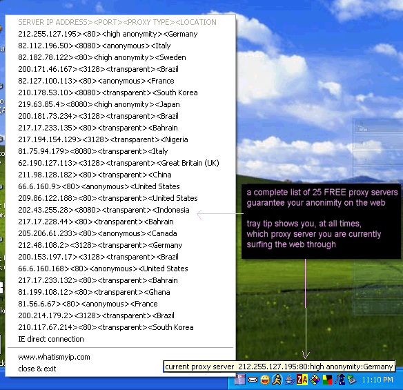



## Instant Proxy \(screenshot\) total anonimity on the internet is now your with a simple mouse click

### Description

This is a program who's entire interface is an icon in your system tray that brings up a menu when you right click the trays icon. This menu contains 25 of the freshest FREE proxy servers. A proxy server is another computer that your computer routes through. The whole point of this is its like putting on a mask..the internet cant see who you are (your ip address and other sensitive identifying information) the proxy server becomes your mask guaranteeing your privacy and anonimity on the net. Just point and click to select from one of the 25 FREE proxy servers.
 
### More Info
 

             |
---                |---
**Submitted On**   |2005-02-23 23:17:16
**By**             |[Evan Toder](https://github.com/Planet-Source-Code/PSCIndex/blob/master/ByAuthor/evan-toder.md)
**Level**          |Intermediate
**User Rating**    |4.8 (29 globes from 6 users)
**Compatibility**  |VB 4\.0 \(16\-bit\), VB 5\.0, VB 6\.0
**Category**       |[Complete Applications](https://github.com/Planet-Source-Code/PSCIndex/blob/master/ByCategory/complete-applications__1-27.md)
**World**          |[Visual Basic](https://github.com/Planet-Source-Code/PSCIndex/blob/master/ByWorld/visual-basic.md)
**Archive File**   |[Instant\_Pr1856912232005\.zip](https://github.com/Planet-Source-Code/evan-toder-instant-proxy-screenshot-total-anonimity-on-the-internet-is-now-your-with-a-sim__1-59114/archive/master.zip)

